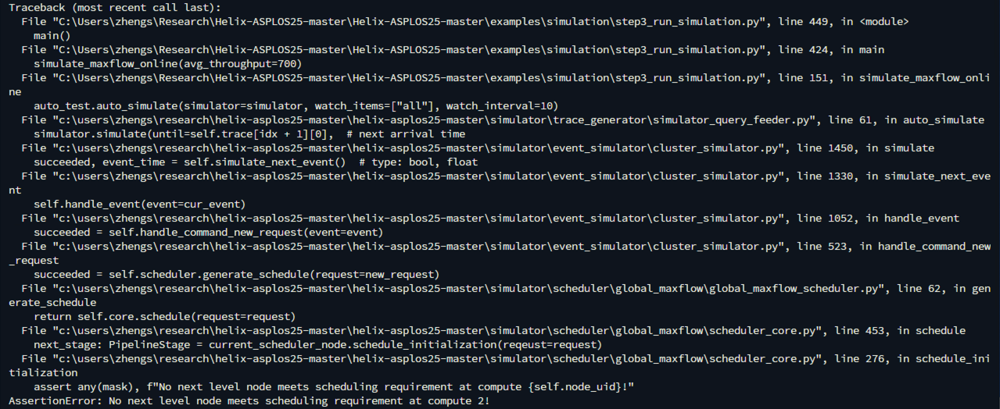

[TOC]

LoC： lines of codes

OOM：out of memory

# Paper Content

## Abstract

high

throughput, low-latency large language model (LLM) serving on heterogeneous GPU clusters。

我觉得这个还真的是，挺有意思的，因为我之前就一直有在想，通常来讲大家用的集群都是比较统一的，但是用这种比较统一的集群很显然就是会比较贵，如果随便有什么GPU，就加到cluster里，然后还能用的话，听起来就很平民。

 a *max-flow* problem for a directed, weighted graph

那这个就是很经典的优化问题了。

很自然，他们就用到了mixed integer linear programming (MILP) algorithm，很巧这学期学了linear programming或者说是linear optimization。

前面那个图又让我想到tensorflow这个框架，就tensorflow就是出一个计算图，这样的话可以做很多优化，就所谓的 optimize model placement and request scheduling，不知道这两者有没有什么相同之处。

## **1 Introduction**

模型太大，部署太贵。

跟我之前想的少有出入，但是和新想法是一样的。他这里想的是cloud厂商有很多heterogeneous GPU在各个data center里。我想的是个人算力了，就是个人算力肯定是乱七八糟的，但也是分布式系统，而且如果能整合的话我觉得应该会很便宜了。

introduction里有很多background，然后还有很多related work。他这里说的是之前的工作主要还是focus on training而不是inference。

之前说过的pipeline model parallelism，就是会有这个算力分配问题，如果你用heterogeneous的system，甚至来讲可能更适合。

GPU and network heterogeneity

解决模型并行问题，解决request scheduling

## **2 Background**

Most of today’s LLMs adopt a decoder-only Transformer

architecture

介绍Transformer，模型怎么输出。

memory demand，要存中间states，存在kv-cache里。很多方法用来减少kv-cache。

Tensor Parallelism, 其实就是竖着切的model parallelism。但是需要大量通讯。

pipeline parallelism被用到横着切的model parallelism，然后再把每一个batch切成mini-batch，这样就可以流水线了。但是要切的很好，要不然就有pipeline bubbles。

## **3 Optimization Formulation in Helix**

如图，a是怎么放的GPU，b不好在你layer 3的速度会被layer 2限制住，c的不好之处是region 1和region 2使用low BW连接的，通信有问题。

把问题变成一个图

The edge capacity denotes the number of tokens compute nodes and network connections can process and transmit per second.

？preflow-push algorithm to get the max flow

？这个constraint一点没看懂

？heuristic methods到底是啥。

## **4 Helix Runtime**

？ interleaved weighted round robin (IWRR)

## **5 Evaluation**

首先就是实验的set up。

For the *single cluster setup*, we create a heterogeneous cluster with 4 A100 nodes, 8 L4 nodes and 12 T4 nodes within one region on the Google cloud.

The *distributed cluster setup* has three clusters that contain 4 A100 nodes, 2 L4 nodes + 8 T4 nodes, and 6 L4 nodes + 4 T4 nodes respectively.

For *high GPU heterogeneity* cluster used in simulation, the cluster contains 4 A100 nodes, 6 V100 nodes, 8 L4 nodes, 10 T4 nodes, 4 2*×*L4 nodes, 6 2*×*T4 nodes and 4 4*×*T4 nodes.

### Single Cluster

### **Distributed Clusters**

有一个很神奇的东西，他就是为了跟别的system（Petal，Swarm）比，然后 “To avoid the impact of different scheduling methods so as to isolate the effect of model placement, we use Helix’s request scheduler for all methods.” 但我记得没错的话，Helix自己的scheduler应该是会对Helix这个体系有点优化在的，感觉不一定是一个公平对比。读到后面发现他对这个scheduling有做对比试验，但是针对这个placement的实验，我觉得还是用random比较公平。

Petal用的greedy，Swarm应该是assume system homogenous，然后就分一样的大小给每个GPU

一堆消融实验。

这个也是很神奇，without pruning的var 和 const 竟然更少，with pruning的performance竟然更高，我记得前面说的是performance只低了一点点。

## **6 Related Work**

# My experiment

## Work Log

### 2025.2.9

Follow the instruction. set up the experiment environment on my laptop(Mac). Do the whole defalt process. Everything works fine.

### 2025.2.10

1. See the result of 10 hours of solving MILP, but weird thing happens, the best placement of this 10-hour solving is not feasible. (T1)

2. Try around 10 minutes solving, default set up work(offline, maxflow, placement of ilp). However, the placement is obviously not good(4 GPU not used). 

3. OOM try different setup(online, maxflow, placement of ilp).

4. Try do this in the Linux machine. Do the environment thing from scratch. Basically same resultas 3
5. Try offline, swarm, placement of swarm. This I change some code. Run this on my local. Start works fine, then exceed KV-cache. Also weird.
6. One thing really interesting is that, in the simulator, the step_two, which is sloving a MILP problem to get the node placement, is a computation demending task. In every platform, the CPU usage can be go up to almost 100%. However, the memory usage is not a lot.
7. The step_three, which is the actual simulating, contrary to the 6, is a memory demanding task. However, it do not use too much memory.

### 2025.2.11

1. Try this envirment on the remote windows machine(70GB memory), set up environment form scratch. 

2. Do the online, maxflow, placement of ilp. No OOP. but "AssertionError: No next level node meets scheduling requirement at compute 2!"

   

3. Basically because of the placement. Just directly try their placement.

### 2025.2.12

1. Do lots of experiments.
2. About the picture. I actually wonder why they do not save pictures for other scheduling methods. Then, I just found that their trend showing in the picture is basically same, which I actually do not know why. The only different thing I found is the throughput of the online methods different from the offline.

## T1

测试实验

跑了10个小时，然而跑出来的最优解违反了一些要求。

## Helix's default placement

Single Cluster

This is basically the request schedle deep dive.

The above three is maxflow offline

This one is maxflow online.

### Offline

#### Layout: ILP, Scheduler: MaxFlow

#### Layout: ILP, Scheduler: Swarm

#### Layout: ILP, Scheduler: Random

#### Layout: ILP, Scheduler: Shortest_queue

### Online

#### Layout: ILP, Scheduler: MaxFlow

#### Layout: ILP, Scheduler: Swarm

#### Layout: ILP, Scheduler: Random

#### Layout: ILP, Scheduler: Shortest_queue

## Request Scheduling Deep Dive 

### Offline

#### Layout: ILP, Scheduler: MaxFlow

