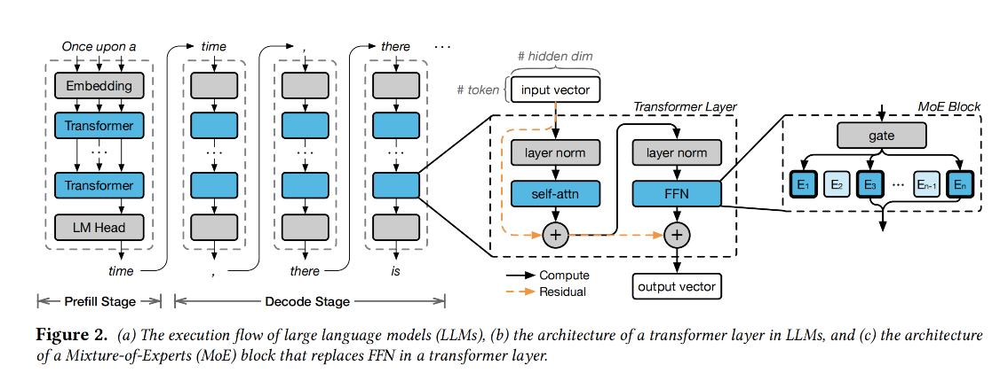

# ProMoE: Fast MoE-based LLM Serving using Proactive Caching[^1]

Time to First Token (TTFT)

Tokens Per Second (TPS)

Time Per Output Token (TPOT)

bits per weight (BPW)

## Content

**Abstract**:

A novel proactive caching system that leverages intermediate model results to predict subsequent parameter usage. 

**1. Introduction**:

memory constraints.

**proactive** caching

learned predictor, which is a neural network.

coordinate the execution of prefetching and inference processes to avoid them interfere each other

**2. Background**:

LLM perform inference in two stages: profile and decode.

1. Profill的时候就是input string parallel process，然后生成第一个词
2. decode就是用前一个词生成后面的词

在offloading experts的时候，传数据很费时间，GPU利用率就不高。传统就是想要把目前最常用的存在GPU memory里。如果missing experts，那么计算就会停。

**3. Overview of ProMoE**

ProMoE introduces a

learned predictor to prefetch experts in a sliding-window manner.

？ sliding-window manner

 three key techniques： **chunked prefetch, early preemption, and reordered inference**.

**4. Goodpred and Learning-based Predictor**：

two key requirements for the predictor: accuracy and lead time

New metric，GOODPRED，就是accuracy和fetchrate相乘。

using input token id to predict the experts used

Iteration-wise（token- based），一次iteration把layer的experts都预测了，时间留的很足，但是accuracy低；layer-wise（skip-based），用这一层预测下一层，很准，但是留的时间太少了。自然想到跨很多层，但是问题是他是直接把i- layer的输入，直接给i+k-layer的gate，看看什么experts会被activate。跨太多input会变很多，就很不准了。作者就是基于这个sliding-window的方法，记录历史数据，然后训练一个小的neural network去predict。

**5. Coordination of Prefetching and Inference**：

**Chunked Prefetch**：The key idea is to split the parameters of each expert

into multiple chunks.

**Early Preemption**： the set of experts required for the current layer is determined all at once when the gate operation completes. 所以其实不需要等到计算到才知道。除此在知道当前层的experts之后，还可以直接把在队列里的同层的但是不会被用到的experts直接移掉。

**Reordered Inference**：

经过一个gate之后，我们知道那些expert需要被activated，但是，正常的computation是按顺序的，所以有的时候后面的experts没有missing，而前面的missing了，可是我们还是在等，reordering就是说把missing的放最后。

**6. Implementation**：

**7. Evaluation**：

消融实验

这个就很清晰了，就一个一个trick往上加。

可以看到就是batch size大了之后计算性能会高一点，这个分布式训练系统是比较常见的。比如ZeRO的一大卖点是取得了超线性的性能提升，就是因为机器多了之后，每个机器分到的模型参数小了，有更多的内存去加大这个batch size，导致就是说计算变多了但是相对应的通讯没有变多，总体体现出的性能就变好了。ProMoE这篇直接就说了更快的速度是因为更大的batch size之后，可以有更久的时间去取数据，其实就还是计算通信比变高了，通信消耗的时间可以被隐藏，换句话说是可以做异步。

这里就是换参数精度，可以看到基于llama.cpp的模型都是精度越低计算越快，符合我们的期望。

**8. Related Work**

ProMoE, on the other hand, designs a learned prediction method with high GOODPRED and focuses on **latency-oriented inference** on edge devices.

**9. Conclusion**

proactive caching approach

Mainly about cache but also involves prefetching.

less GPU, and low inference latency.

## Notes

For the chucked prefetch, is it possible for us do not use fixed chuck. 就比如我现在有一个task正在load parameter，然后有个优先级高的，我直接在这个时候分割，就比如在当前位置偏后一点，打一个label，直接把high priority的放前面。

[^1]: Xiaoniu Song, Zihang Zhong, and Rong Chen. 2024. ProMoE: Fast MoE-based LLM Serving using Proactive Caching. [https://doi.org/10.48550/arXiv.2410.22134](https://urldefense.com/v3/__https:/doi.org/10.48550/arXiv.2410.22134__;!!Mak6IKo!JGsmunK4816F9qTIzFh0QAl_Tgr55CX5aR2IjjIRrsDaJvPzsI_qdQNouSpg-XfJEGex1dhRSBnoetB26mo3fg$)